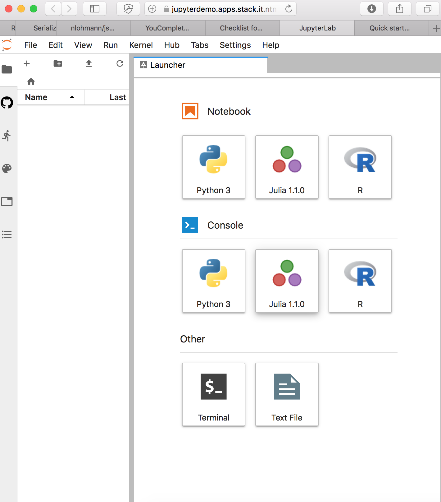
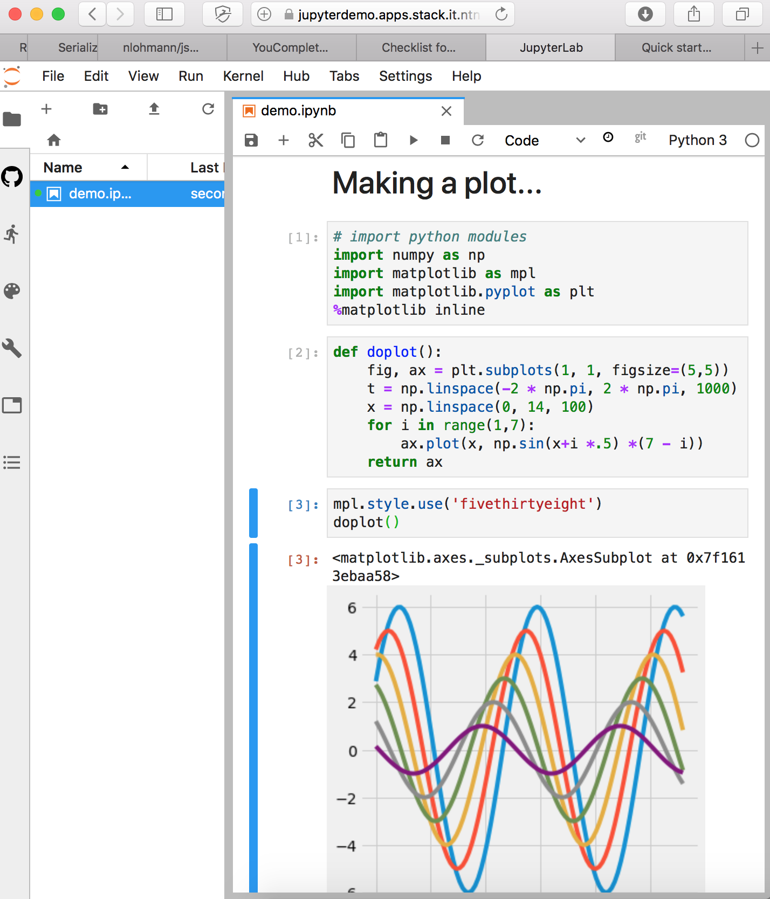
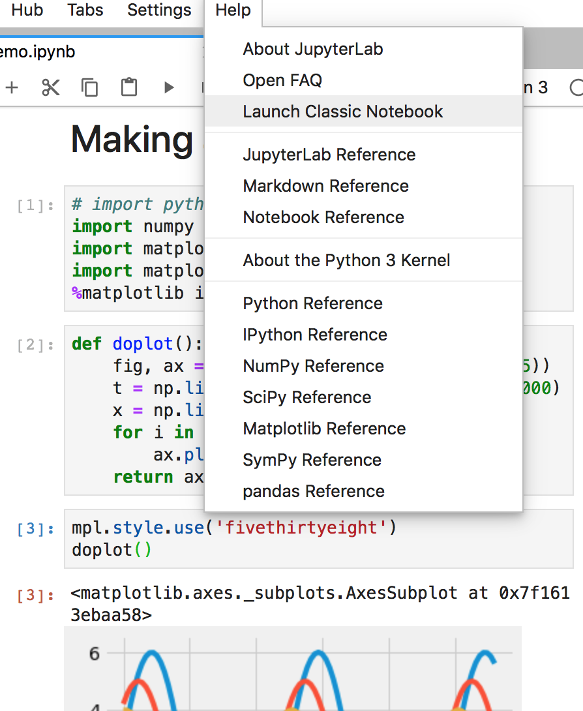
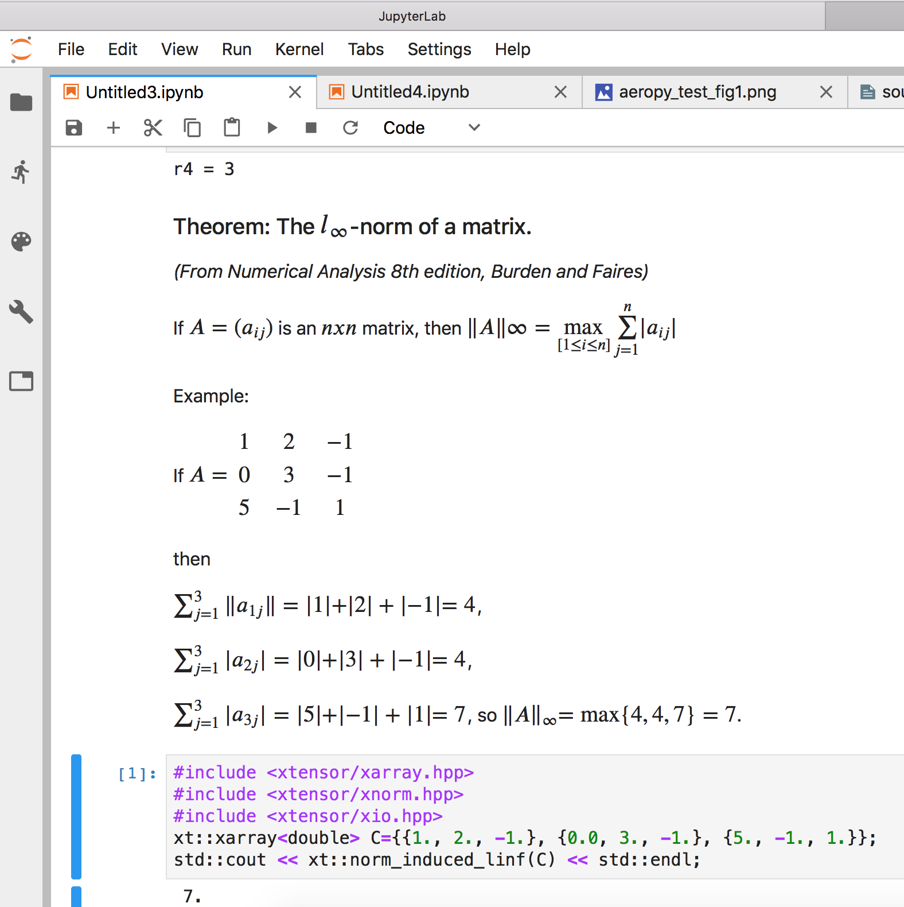
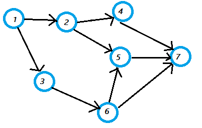
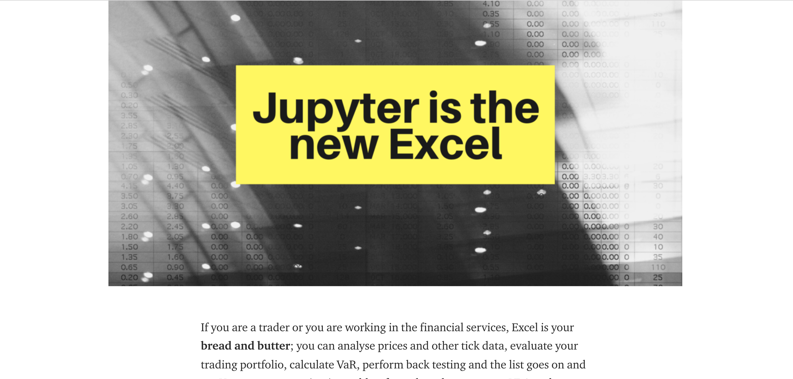

background-image: url(img/jupyterlogobackground.png)
background-size: 1600px 900px
class: center, middle
#
## Demo site at NTNU
https://jupyterdemo.apps.stack.it.ntnu.no

???

Login to Dataporten with Feide

---

## JupyterLab

---
## Explore...

---

## Classic Jupyter Notebook

---
## What is JupyterLab / Jupyter Notebook?
A computing environment for literate computing.
- Literate computing is text, formula and code interleaved to create a narrative.

???
- Litterate computing:*The practitioner of literate programming can be re- garded as
  an essayist, whose main concern is with ex- position and excellence of style.
  Such an author, with thesaurus in hand, chooses the names of variables care-
  fully and explains what each variable means. He or she strives for a program
  that is comprehensible because its concepts have been introduced in an order
  that is best for human understanding, using a mixture of formal and informal
  methods that re ̈ınforce each other.* --Donald E. Knuth

---
## An Example: Explanation of a Matrix Norm

---

## Some history
- In 2014, Fernando Pérez announced a spin-off project from IPython called Project Jupyter, moving the notebook and other language-agnostic parts of IPython to Jupyter
- JupyterLab is the next generation interface for Project Jupyter, the first stable release was announced in February 2018.
- [The popularity of Jupyter is steadily increasing in sciences](https://www.nature.com/articles/d41586-018-07196-1).
- The name "Jupyter" derives from Julia+Python+R, but today Jupyter kernels exist for [dozens of programming languages](https://github.com/jupyter/jupyter/wiki/Jupyter-kernels)
- Galileo's publication in a pamphlet in 1610 in Sidereus Nuncius, one of the first notebooks!  

- Project Jupyter consists of several very large open source projects. For example, JupyterLab has: 
    - ~4 years of development
    - ~60 separate components
    - ~150 contributors 
    - ~14000 commits
    - currently a beta release, but stable interface and developer API ("user 1.0")

---

## How it works:

---

## Operating in a Graph vs Working in a Closet

???
https://fineartamerica.com/featured/16th-century-woodcut-showing-an-alchemist-at-work-science-photo-library.html
- JupyterLab/Notebook is better suited for a working in a community than traditional Domain Specific Languages/tools
- Matlab, Microsoft VBA/Word/Excel/Powerpoint/, Comsol, Ansys
---

### [Jupyter is the new excel](https://towardsdatascience.com/jupyter-is-the-new-excel-a7a22f2fc13a)

???
Domain Specific Language hitting a boundary
---

background-image: url(img/jupyterlogobackground.png)
background-size: 1600px 900px
